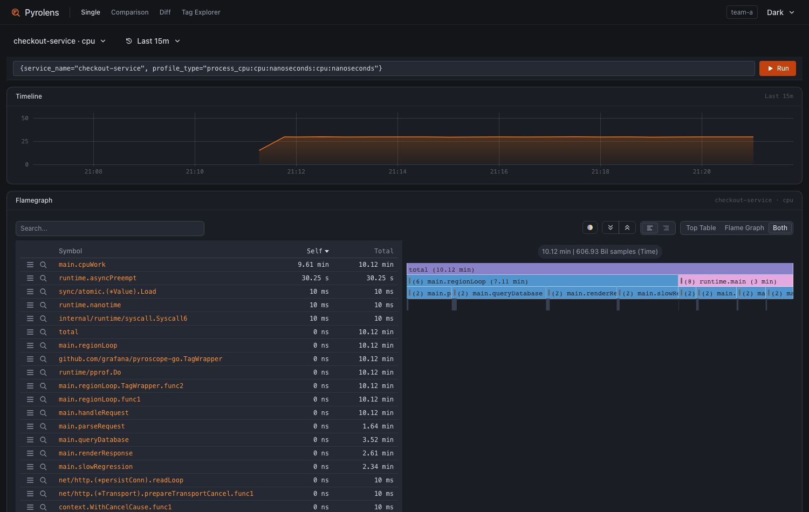
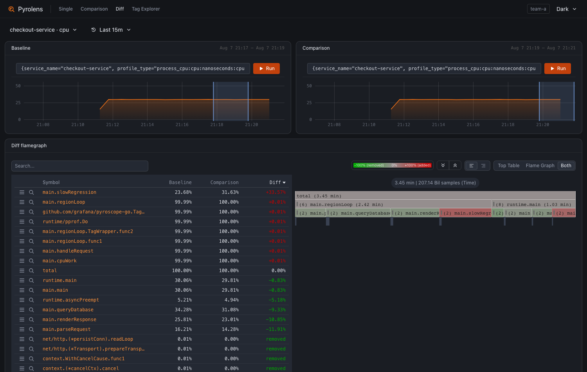
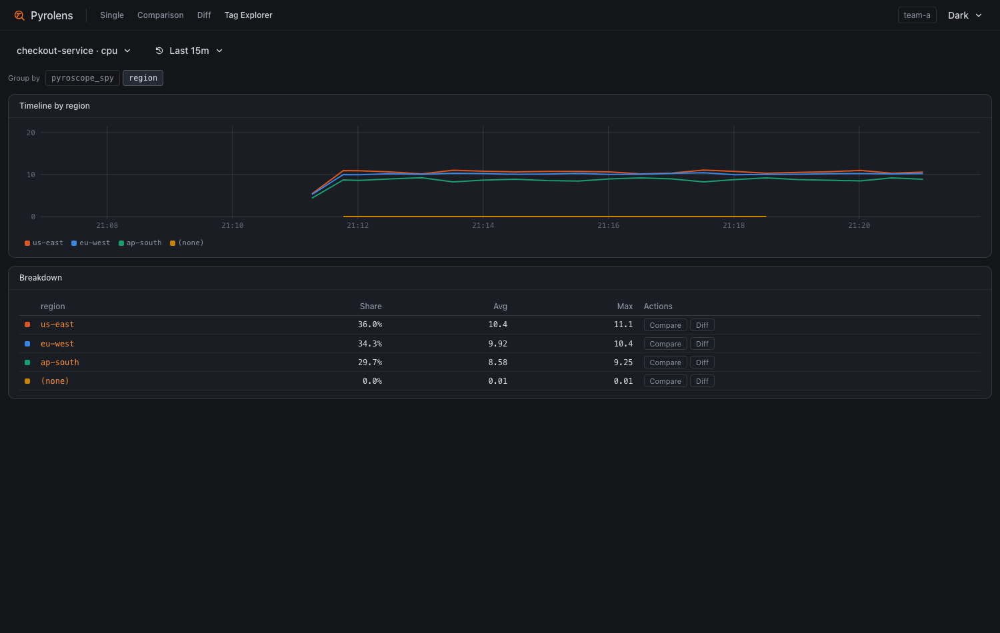
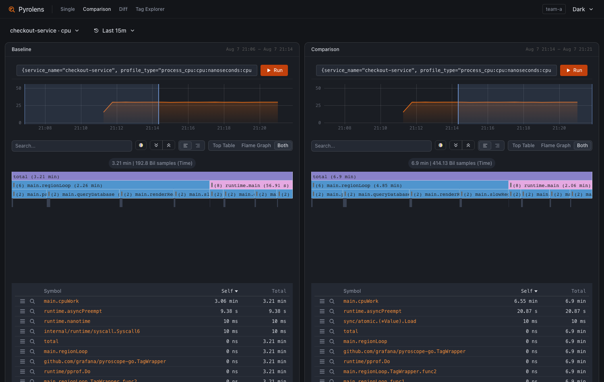

# Pyrolens

Pyrolens brings the classic Pyroscope UI experience — **Tag Explorer, Single,
Comparison, and Diff views** — to Grafana Pyroscope, as a single
self-contained binary / Docker image.

> Pyrolens is an unofficial project and is not affiliated with or endorsed by
> Grafana Labs. "Pyroscope" is a trademark of Grafana Labs, used here only to
> describe compatibility.



**Works with Pyroscope v1 (tested: v1.21.1) and v2 (tested: v2.2.1).** The UI
only speaks the `querier.v1.QuerierService` API, which both major versions
serve, in both single-tenant and multi-tenant (`-auth.multitenancy-enabled`)
setups.

Pyroscope 2.0 replaced its embedded UI with a minimal viewer and moved the
full analysis experience into Grafana (Profiles Drilldown). This project
brings the classic workflow back, plus a few things the old UI never had:

- **Everything is in the URL.** Tenant, query, time ranges, comparison
  selections, group-by label — copy the address bar and a teammate sees the
  exact same screen. (The classic UI kept the tenant out of the URL, which
  made sharing queries in multi-tenant setups painful.)
- **First-class multi-tenancy.** The tenant is a `tenant` URL param sent as
  `X-Scope-OrgID`; switch tenants from the nav bar. No per-tenant data
  sources to manage.
- **Comparison view** colors frames by package-name hash, so the same
  function has the same color in both panes. **Diff view** shows the classic
  green/red differential flame graph (color-blind palette available).

## The views

**Diff** — what got slower between two windows, ranked. Here an extra
`slowRegression` frame shows up as `+33.57%`.



**Tag Explorer** — break a service down by any label, then jump straight
into a Comparison or Diff for one value of it.



**Comparison** — two independent queries and time windows side by side,
with matching colors so the same function is the same color in both.



## Quick start

```sh
# Docker
docker run -p 4041:4041 -e PYROSCOPE_URL=http://pyroscope:4040 \
  ghcr.io/be-hase/pyrolens

# or grab a binary (linux/darwin, amd64/arm64) from the releases page:
# https://github.com/be-hase/pyrolens/releases
PYROSCOPE_URL=http://pyroscope.example:4040 ./pyrolens

# or build from source (needs Node >= 24 and Go >= 1.25)
make run                                      # serves on :4041, proxies to localhost:4040
PYROSCOPE_URL=http://pyroscope.example:4040 make run
```

The binary and the image are the same thing: one self-contained server with
the UI embedded, no runtime dependencies.

Flags / env of the server binary:

| Flag             | Env             | Default                 |                         |
| ---------------- | --------------- | ----------------------- | ----------------------- |
| `-listen`        | `LISTEN`        | `:4041`                 | address to listen on    |
| `-pyroscope-url` | `PYROSCOPE_URL` | `http://localhost:4040` | Pyroscope server to use |

The server embeds the built SPA and reverse-proxies
`/querier.v1.QuerierService/*` and `/pyroscope/*` to the Pyroscope server, so
the browser talks to a single origin and your Pyroscope server never needs
CORS or direct exposure.

## URL parameters

All state is carried in query parameters; every view is shareable.

| Param                                              | Meaning                                                              |
| -------------------------------------------------- | -------------------------------------------------------------------- |
| `tenant`                                           | tenant ID, sent as `X-Scope-OrgID` (multi-tenant Pyroscope only)     |
| `query`                                            | label selector incl. `profile_type`, e.g. `{service_name="x", ...}`  |
| `from` / `until`                                   | main time range — `now-1h`-style relative or unix-ms absolute        |
| `leftQuery` / `leftFrom` / `leftUntil` (+ `right…`) | Comparison & Diff pane selections; default to `query` / range halves |
| `groupBy`                                          | Tag Explorer grouping label                                          |

Views: `/` (Single), `/comparison`, `/diff`, `/explore` (Tag Explorer).

## Development

```sh
corepack enable                # yarn 4
yarn install
yarn dev                       # vite dev server on :5173, proxies to localhost:4040
PYROSCOPE_URL=http://host:4040 yarn dev

yarn test                      # unit tests (node:test)
yarn lint && yarn type-check
```

A local Pyroscope to develop against:

```sh
# single tenant
docker run -p 4040:4040 grafana/pyroscope
# multi-tenant (the UI will prompt for a tenant ID)
docker run -p 4040:4040 grafana/pyroscope -auth.multitenancy-enabled
```

## License

Pyrolens is licensed **Apache-2.0** (see `LICENSE`). Bundled third-party
code retains its own license file alongside the code.
